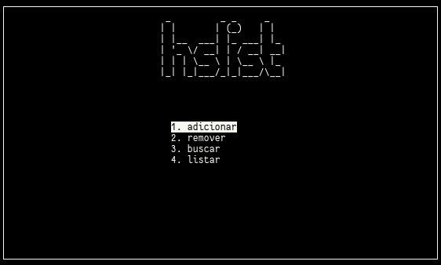

## HSList

Lista telefone implementada em C usando Hash Table e Openssl.
Com uma simples interface de usuário via ncurses.

 


### Instalação
Para compilar é necessário instalar:

- `gcc`, `make`
- `openssl`, `ncurses`

e em seguida:

```shell
git clone https://github.com/felipepegoraro/hslist
cd hslist
make
```

por padrão, será utilizado um hashtable de no máximo 1024 slots, mas se preferir altere esse valor (por exemplo, 2048):

```shell
make MAX_HS_SIZE=2048
```
