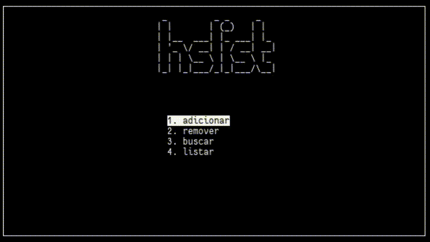

## HSList

Lista telefone implementada em C usando Hash Table e Openssl.
Com uma simples interface de usuário via ncurses. Os dados são
armazenados (e lidos) num arquivo `.csv`.



### Instalação
Para compilar é necessário instalar:

- `gcc`, `make`
- `openssl`, `ncurses`

e em seguida:

```shell
git clone https://github.com/felipepegoraro/hslist
cd hslist
make
```

Por padrão será utilizado um hashtable de no máximo 1024 slots, mas se preferir 
altere esse valor durante a compilação. Para um determinado número `n` de slots, faça:

```shell
make MAX_HS_SIZE=n
```

Assim como o path para o arquivo csv de armazenamento, por exemplo:

```shell
make CONTACT_LIST_FILENAME=~/.lista_telefonica
```
